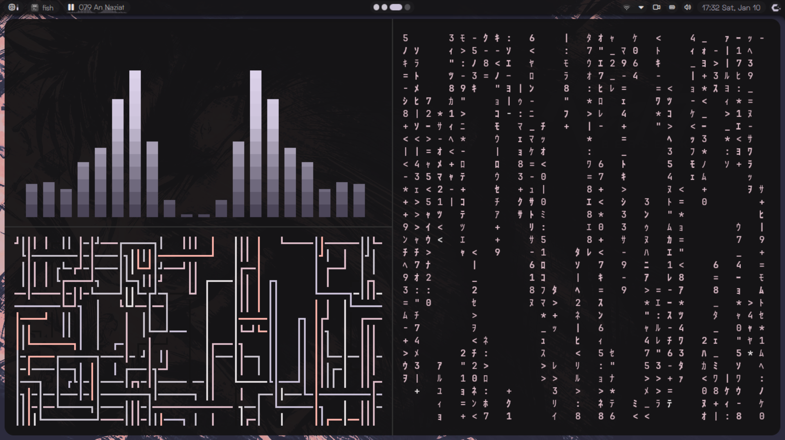
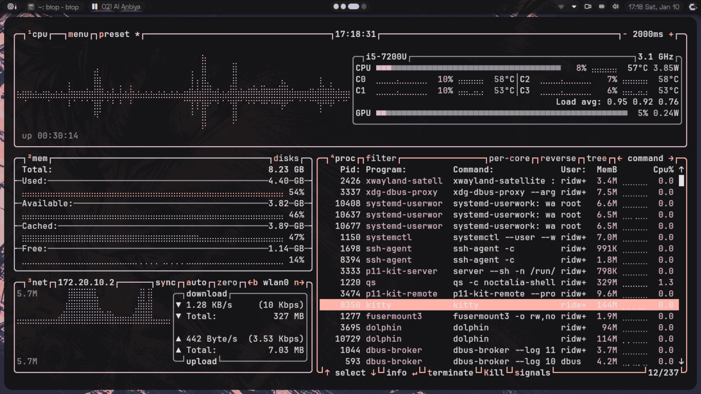
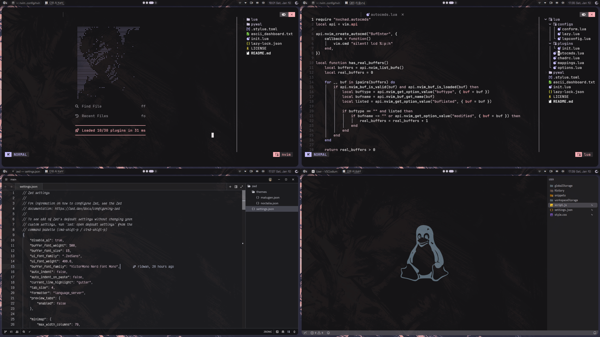
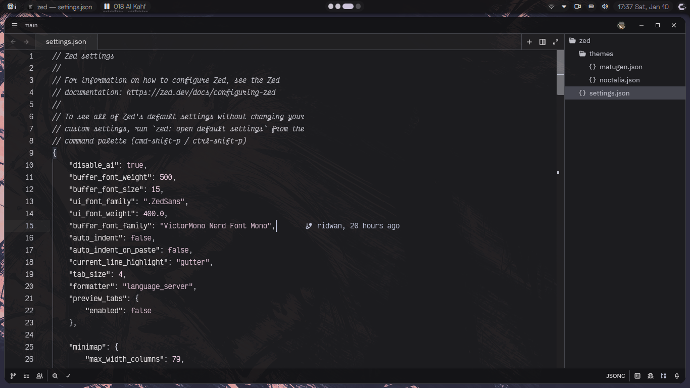

```lua
-- ~/dotfiles

local system = {
  os = "CachyOS (Arch Linux)",
  wayland_compositor = "niri",
}

local tools = {
  shell = "fish",
  terminal = "kitty",
  editors = { "zed", "neovim (nvchad)", "vscodium" },
  file_manager = "dolphin",
  web_browser = "zen"
}

local ui = {
  shell = "quickshell (noctalia)",
  font = "satoshi",
}
```

<table style="width: 100%;">
<tr>
<td align="center"><br><b>kitty x terminal rice</b></td>
<td align="center"><br><b>kitty x btop</b></td>
</tr>
<tr>
<td align="center"><br><b>nvim x vscodium</b></td>
<td align="center"><br><b>zed</b></td>
</tr>
</table>

---

## Installation & Management

This dotfiles repository is managed using [GNU Stow](https://www.gnu.org/software/stow/) for clean symlink management.

### Prerequisites
```bash
# Install GNU Stow (Arch/CachyOS)
sudo pacman -S stow

# Install GNU Stow (Debian/Ubuntu)
sudo apt install stow

# Install GNU Stow (Fedora)
sudo dnf install stow
```

### Setup
```bash
# Clone the repository (choose one)
git clone https://codeberg.org/ridwan/dotfiles.git ~/dotfiles

cd ~/dotfiles

# Make scripts executable (if needed)
chmod +x stow_all.sh unstow_all.sh

# Stow all configurations
./stow_all.sh
```

### Management
```bash
# Unstow all configurations
./unstow_all.sh

# Stow individual packages
stow nvim
stow kitty

# Troubleshooting tips
# - If conflicts occur, check existing files: ls -la ~/.config
# - To remove conflicts: stow -D <package> then stow <package>
# - For verbose output: stow -v <package>
```

---

_noctalia showcase_

