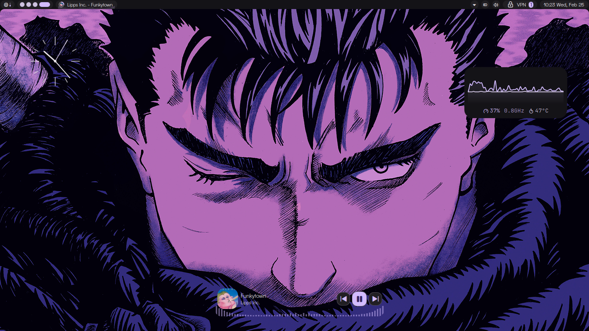
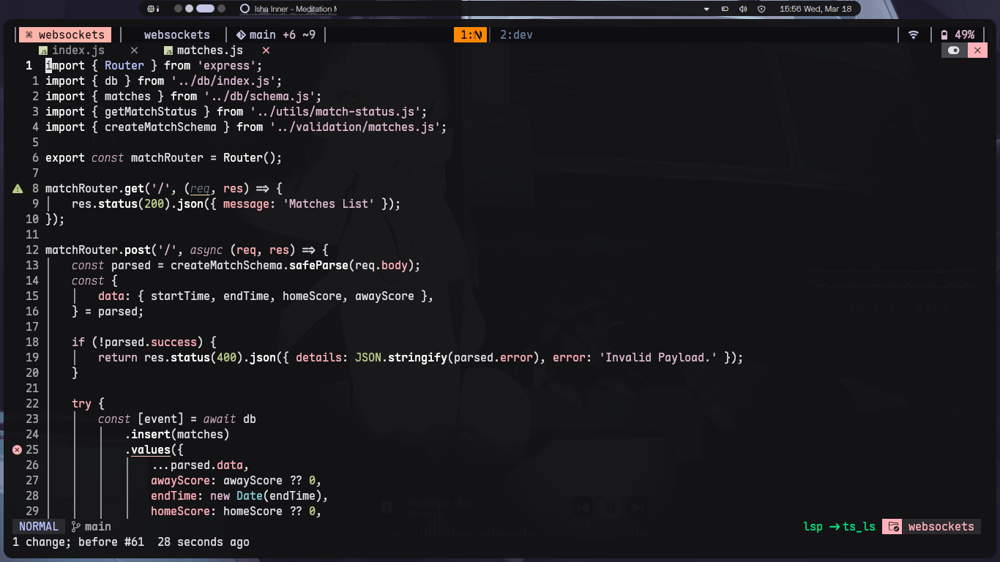
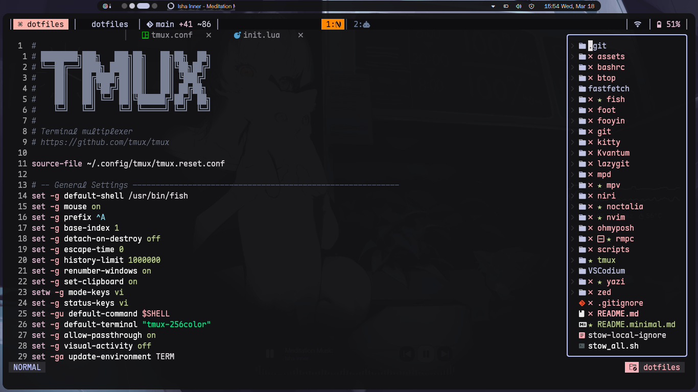
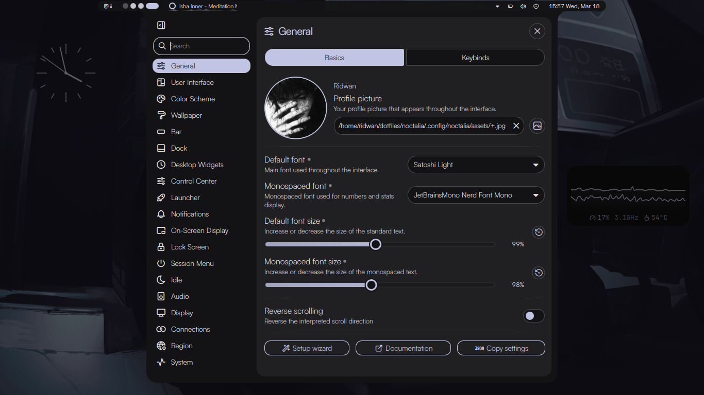
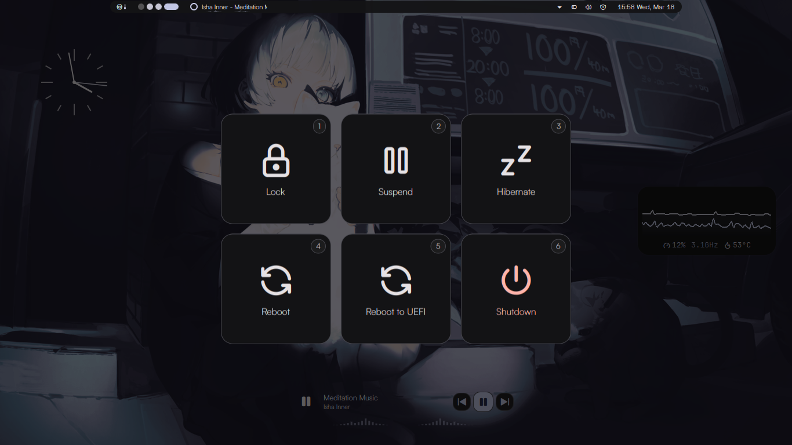
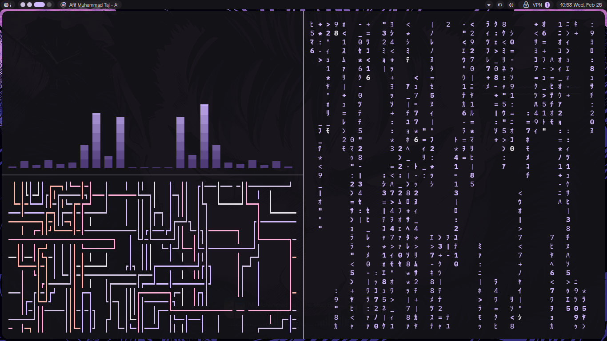

```lua
--~/dotfiles

local system = {
  os = "CachyOS (Arch Linux)",
  wayland_compositor = "niri",
}

local tools = {
  shell = "fish",
  terminal = "kitty",
  multiplexer = "tmux",
  editors = { "neovim", "zed", "VSCodium" },
  file_manager ={  "yazi", "dolphin" },
  web_browser = "zen"
}

local ui = {
  shell = "quickshell (noctalia)",
  font ={  "satoshi" , "Meslo Nerd Font" }
}
```

---

## Previews

<details>
<summary>Showcase</summary>








</details>

---

## Installation & Management

Managed with [GNU Stow](https://www.gnu.org/software/stow/) for symlink-based config management.

> [!NOTE]
> Modular dotfiles — stow only the packages you need.

### Prerequisites

```bash
# Arch/CachyOS
sudo pacman -S stow

# Debian/Ubuntu
sudo apt install stow

# Fedora
sudo dnf install stow
```

### Setup

```bash
git clone https://codeberg.org/ridwan/dotfiles.git ~/dotfiles
cd ~/dotfiles
chmod +x stow_all.sh unstow_all.sh
```

### Usage

```bash
# Stow individual packages
stow nvim
stow kitty
stow fish
stow tmux
stow yazi

# Stow/unstow all packages
./stow_all.sh
./unstow_all.sh
```

### Troubleshooting

```bash
# Check existing config files
ls -la ~/.config

# Remove conflicting symlink
stow -D <package>

# Re-stow a package
stow <package>

# Verbose output
stow -v <package>
```

---

## Directory Structure

| Directory    | Description                 |
| ------------ | --------------------------- |
| `bashrc/`    | Bash configuration          |
| `btop/`      | btop system monitor         |
| `fastfetch/` | fastfetch system info       |
| `fish/`      | Fish shell config           |
| `foot/`      | Foot terminal config        |
| `fooyin/`    | Fooyin music player         |
| `git/`       | Git global config           |
| `kitty/`     | Kitty terminal config       |
| `Kvantum/`   | Qt theme engine config      |
| `lazygit/`   | LazyGit TUI config          |
| `mpd/`       | Music Player Daemon         |
| `mpv/`       | MPV video player config     |
| `niri/`      | Niri window manager         |
| `noctalia/`  | Noctalia quickshell widgets |
| `nvim/`      | Neovim (NvChad)             |
| `ohmyposh/`  | Oh My Posh prompt themes    |
| `rmpc/`      | rmpc MPD client             |
| `scripts/`   | Utility scripts             |
| `tmux/`      | Tmux terminal multiplexer   |
| `VSCodium/`  | VSCodium editor config      |
| `yazi/`      | Yazi file manager           |
| `zed/`       | Zed editor config           |
