```lua
--~/dotfiles

local system = {
  os = "CachyOS (Arch Linux)",
  wayland_compositor = "niri",
}

local tools = {
  shell = "fish",
  terminal = "kitty",
  editors = { "neovim (NvChad)", "zed", "VSCodium" },
  file_manager = "dolphin",
  web_browser = "zen"
}

local ui = {
  shell = "quickshell (noctalia)",
  font ={  "satoshi" , "LiLex Nerd Font" }
}
```

---

## Previews

<details>
  <summary>Desktop Overview</summary>
  
  
</details>

<details>
  <summary>Terminal & Shell</summary>
  
  
</details>

<details>
  <summary>Code Editors</summary>
  
  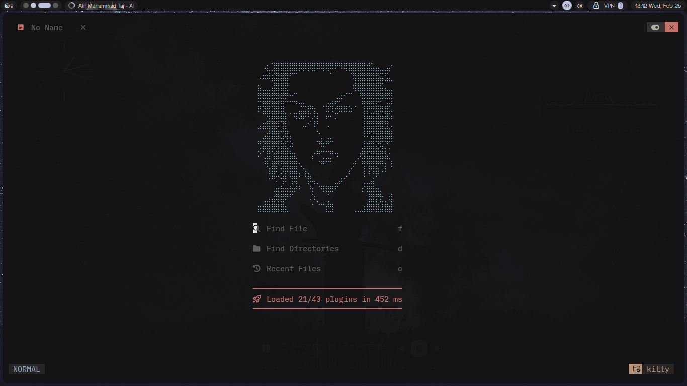
  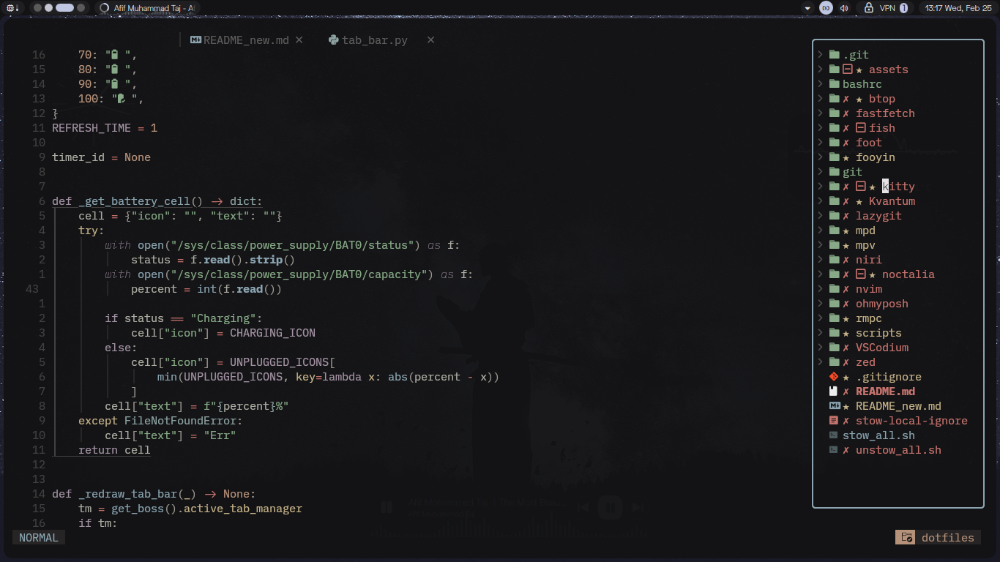
  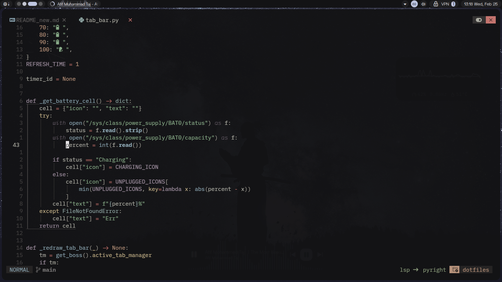
  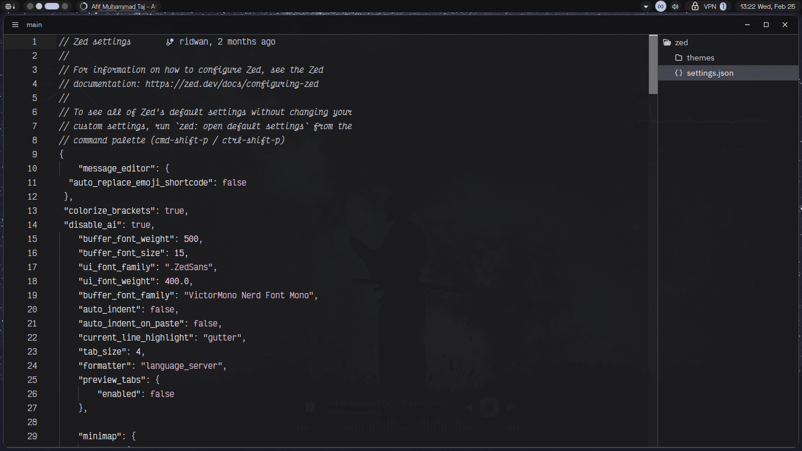
</details>

<details>
  <summary>System Tools</summary>
  
  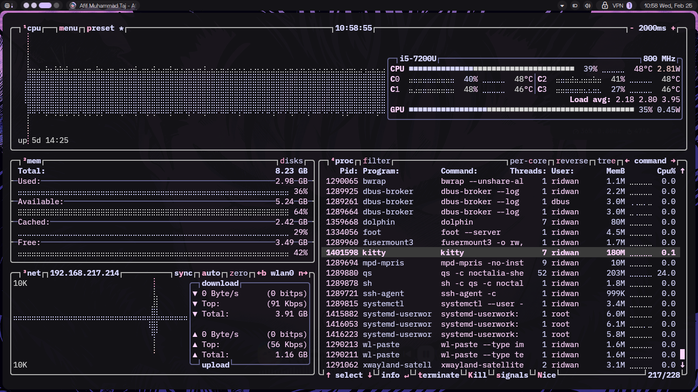
  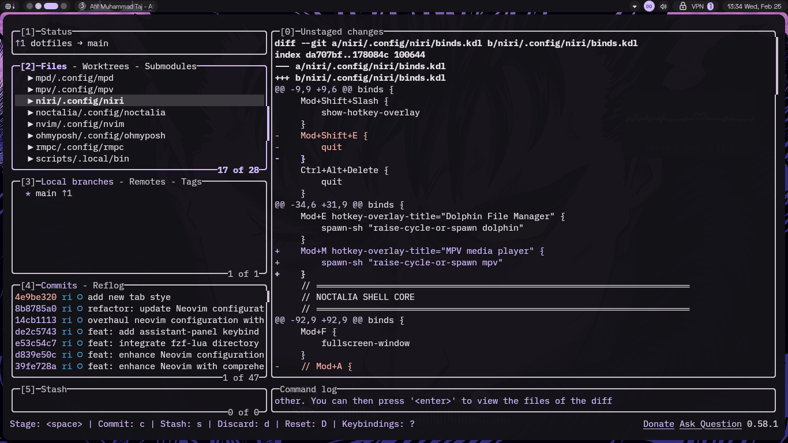
</details>

<details>
  <summary>Media Players</summary>
  
  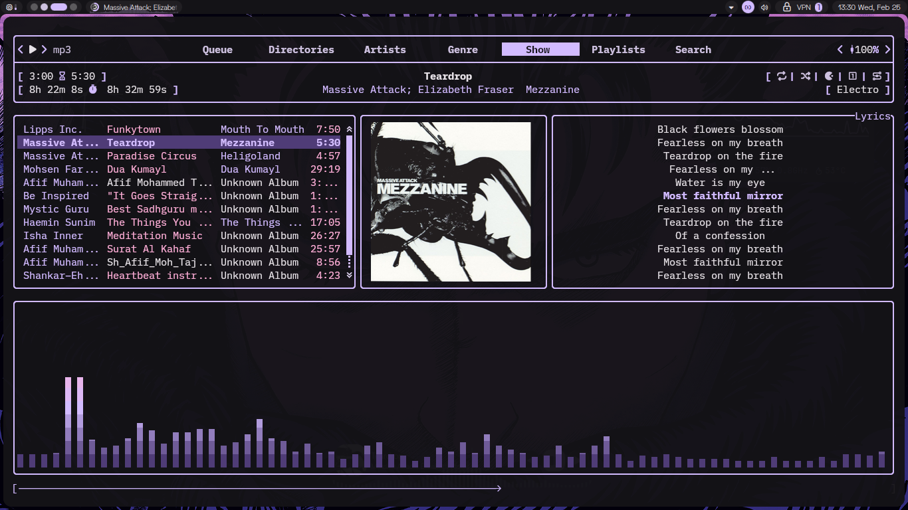
  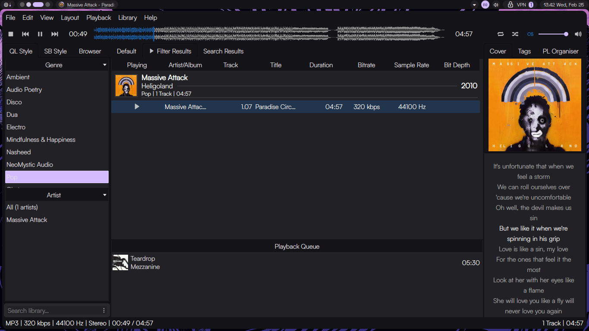
  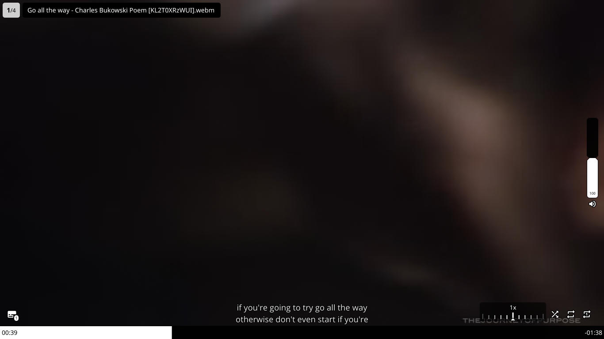
</details>

<details>
  <summary>Noctalia Widgets</summary>
  
  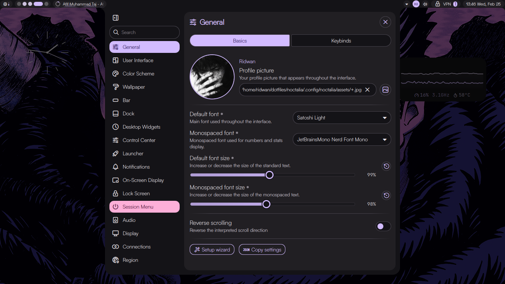
  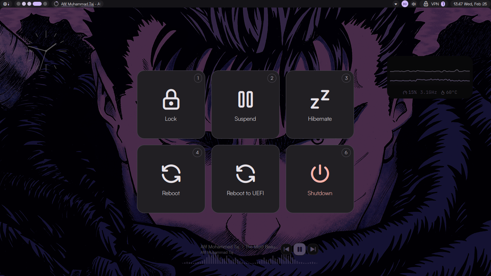

</details>

---

## Dependencies

### Core

- **stow** - Symlink-based config management
- **fish** - Shell

### Wayland

- **niri** - Window manager
- **brightnessctl** - Brightness control
- **pipewire** - Audio server

### Terminals

- **kitty** - Terminal emulator
- **foot** - Terminal emulator

### Editors

- **neovim** - Text editor (NvChad config)
- **zed** - Editor
- **VSCodium** - Editor

### Shell & UI

- **quickshell** - Shell widgets framework
- **noctalia** - Custom quickshell widgets
- **ohmyposh** - Prompt theming

### Development

- **bun** - JavaScript runtime
- **mise** - Runtime version manager
- **lazygit** - Git TUI

### System Tools

- **btop** - System monitor
- **fastfetch** - System info display
- **dolphin** - File manager

### Media

- **mpv** - Video player
- **mpd** - Music Player Daemon
- **rmpc** - MPD client
- **fooyin** - Music player

### Theming

- **qt6ct** / **qt5ct** - Qt theming
- **Kvantum** - Qt theme engine

### Browser

- **zen** - Web browser

### Miscellaneous

- **git** - Version control

---

## Showcase

<details>
  <summary>niri</summary>
  
  **Wayland window manager** with overlapping windows and borders.
  
  Location: `niri/`
</details>

<details>
  <summary>kitty</summary>
  
  **GPU-accelerated terminal emulator** with tab bar support.
  
  Location: `kitty/`
</details>

<details>
  <summary>foot</summary>
  
  **Fast and lightweight** Wayland terminal.
  
  Location: `foot/`
</details>

<details>
  <summary>nvim</summary>
  
  **Neovim** configured with **NvChad** v2.5, featuring:
  - blink.cmp for completion
  - LSP support via nvim-lspconfig
  - nvim-tree.lua file tree
  - nvim-treesitter syntax highlighting
  - fzf fuzzy finder
  - wakatime time tracking
  - cord.nvim Discord presence
  
  Location: `nvim/`
</details>

<details>
  <summary>zed</summary>
  
  **Modern code editor** with native Wayland support.
  
  Location: `zed/`
</details>

<details>
  <summary>VSCodium</summary>
  
  **Open-source VSCode** fork.
  
  Location: `VSCodium/`
</details>

<details>
  <summary>fish</summary>
  
  **Friendly interactive shell** with configuration.
  
  Location: `fish/`
</details>

<details>
  <summary>noctalia</summary>
  
  **Custom quickshell widgets** including:
  - Network manager VPN support
  - Assistant panel
  - Screen recorder
  - User-templates for color generation
  
  Location: `noctalia/`
</details>

<details>
  <summary>ohmyposh</summary>
  
  **Prompt theming** for shell prompts.
  
  Location: `ohmyposh/`
</details>

<details>
  <summary>lazygit</summary>
  
  **Simple Git TUI** for terminal.
  
  Location: `lazygit/`
</details>

<details>
  <summary>btop</summary>
  
  **Resource monitor** showing CPU, memory, disk, and processes.
  
  Location: `btop/`
</details>

<details>
  <summary>fastfetch</summary>
  
  **Fast system information** display tool.
  
  Location: `fastfetch/`
</details>

<details>
  <summary>mpv</summary>
  
  **Video player** with configurable settings.
  
  Location: `mpv/`
</details>

<details>
  <summary>mpd + rmpc</summary>
  
  **Music Player Daemon** with **rmpc** client.
  
  Location: `mpd/`, `rmpc/`
</details>

<details>
  <summary>fooyin</summary>
  
  **Music player** with Qt-based UI.
  
  Location: `fooyin/`
</details>

<details>
  <summary>git</summary>
  
  **Git global configuration** with aliases and settings.
  
  Location: `git/`
</details>

<details>
  <summary>Kvantum</summary>
  
  **Qt theme engine** for KDE/Qt applications.
  
  Location: `Kvantum/`
</details>

---

## Installation & Management

This dotfiles repository is managed using [GNU Stow](https://www.gnu.org/software/stow/) for clean symlink management.

> [!NOTE]
> These dotfiles are modular - it's recommended to stow only the packages you need rather than all at once.

### Prerequisites

```bash
# Install GNU Stow (Arch/CachyOS)
sudo pacman -S stow

# Install GNU Stow (Debian/Ubuntu)
sudo apt install stow

# Install GNU Stow (Fedora)
sudo dnf install stow
```

### Setup

```bash
# Clone the repository
git clone https://codeberg.org/ridwan/dotfiles.git ~/dotfiles

cd ~/dotfiles

# Make scripts executable
chmod +x stow_all.sh unstow_all.sh
```

### Stow Individual Packages

```bash
# Stow specific packages
stow nvim
stow kitty
stow fish
stow niri
stow noctalia

# Stow all packages
./stow_all.sh

# Unstow all packages
./unstow_all.sh
```

### Troubleshooting

```bash
# Check for existing files in ~/.config
ls -la ~/.config

# Remove conflicting symlinks
stow -D <package>

# Re-stow a package
stow <package>

# Verbose output for debugging
stow -v <package>
```

---

## Directory Structure

| Directory    | Description                  |
| ------------ | ---------------------------- |
| `bashrc/`    | Bash configuration           |
| `btop/`      | btop system monitor config   |
| `fastfetch/` | fastfetch system info config |
| `fish/`      | Fish shell configuration     |
| `foot/`      | Foot terminal config         |
| `fooyin/`    | Fooyin music player config   |
| `git/`       | Git global config            |
| `kitty/`     | Kitty terminal config        |
| `Kvantum/`   | Qt theme engine config       |
| `lazygit/`   | LazyGit TUI config           |
| `mpd/`       | Music Player Daemon config   |
| `mpv/`       | MPV video player config      |
| `niri/`      | Niri window manager config   |
| `noctalia/`  | Noctalia quickshell widgets  |
| `nvim/`      | Neovim config (NvChad)       |
| `ohmyposh/`  | Oh My Posh prompt themes     |
| `rmpc/`      | rmpc (MPD client) config     |
| `scripts/`   | Utility scripts              |
| `VSCodium/`  | VSCodium editor config       |
| `zed/`       | Zed editor config            |
